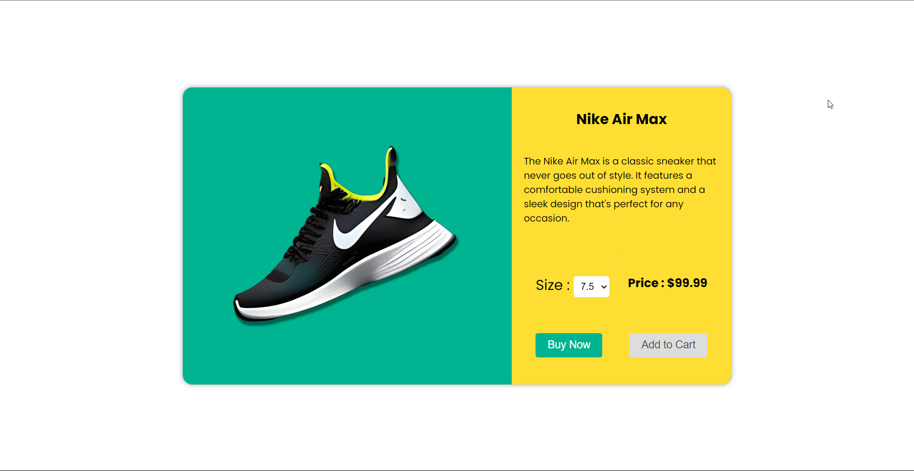
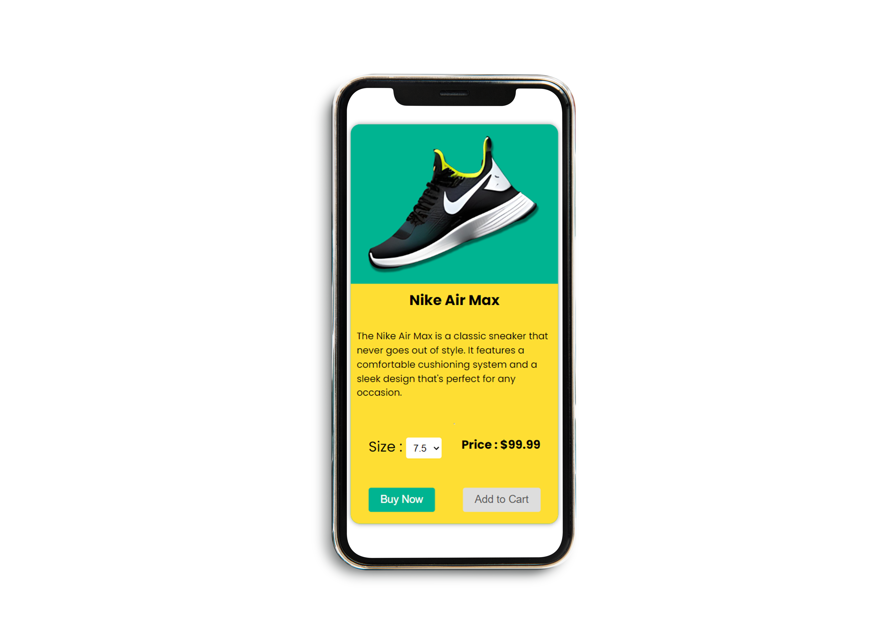

# Responsive Product Card Using HTML, CSS & JS 

## Table of Contents

- [Project Title](#project-title)
- [Description](#description)
- [Features](#features)
- [Demo](#demo)
- [Technologies](#technologies)
- [Installation](#installation)
- [Usage](#usage)
- [Contributing](#contributing)
- [License](#license)

## Description

 This product card includes an image of the product, a brief description, and buttons to add the product to your cart or buy it now. What's unique about this product card is that the price changes when you select different sizes - thanks to the magic of JavaScript! And, it's designed to be compatible with both desktop and mobile screens.

## Features

- Responsive for both desktop and mobile screen 
- The price changes when you select different sizes

## Demo
- Alternatively, a link to a live demo of your project (if available)

## Screenshots 

### Desktop view 

### Mobile view 

## Technologies

- CSS FlexBox
- CSS variables 
- JS if condition

## Contributing

We welcome contributions to improve the project and encourage you to fork this repository and create a pull request. Before contributing, please review the [Code of Conduct](CODE_OF_CONDUCT.md) and [Contributing Guidelines](CONTRIBUTING.md) for this project.

### Getting Started

To get started, you will need to have [Git](https://git-scm.com/) and [Node.js](https://nodejs.org/) installed on your computer. Follow the instructions in the [README.md](README.md) file to set up the project on your local machine.

### Making Changes

1. Create a fork of the repository.
2. Clone the forked repository to your local machine.
3. Make changes to the code or documentation in your local copy.
4. Test your changes to ensure they work as intended.
5. Commit your changes and push them to your forked repository.
6. Create a pull request with a clear description of the changes you made and why they are necessary.

### Style Guide

To ensure consistency and readability of the code, please follow these guidelines:

- Use clear and concise variable names.
- Use comments to explain the purpose of the code, and any functions or classes that are created.
- Follow the existing code formatting and indentation style.
- Use descriptive commit messages that explain the changes made.

### Reporting Bugs and Issues

If you encounter a bug or issue with the project, please open a new issue on the [GitHub Issues](https://github.com/your_username/project_name/issues) page. Be sure to include a detailed description of the problem, including any error messages or screenshots if possible.

### Feature Requests

If you have an idea for a new feature or improvement to the project, please open a new issue on the [GitHub Issues](https://github.com/your_username/project_name/issues) page. Be sure to include a detailed description of the proposed feature, and any use cases or examples of how it would be used.

Thank you for your contributions and support of this project! We look forward to seeing what you can do.

## License

You are free to:

- Use the project for personal or commercial purposes
- Modify and distribute the project
- Use the project for private or public use
- Use the project without any warranty or liability

Under the following conditions:

- You must include a copy of the license in any distribution of the project.
- You must include a copy of the license in any derivative works.
- You must include the original copyright notice in any derivative works.

### Author

- Frontend Mentor - [@Dinil-Thilakarathne](https://www.frontendmentor.io/profile/Dinil-Thilakarathne)
- Instagram - [Dinil Thilakarathne](https://www.instagram.com/sona_code/)
- GitHub - [@Dinil-Thilakarathne](https://github.com/Dinil-Thilakarathne)
- Youtube - [@sonacode](https://www.youtube.com/@sonacode)
